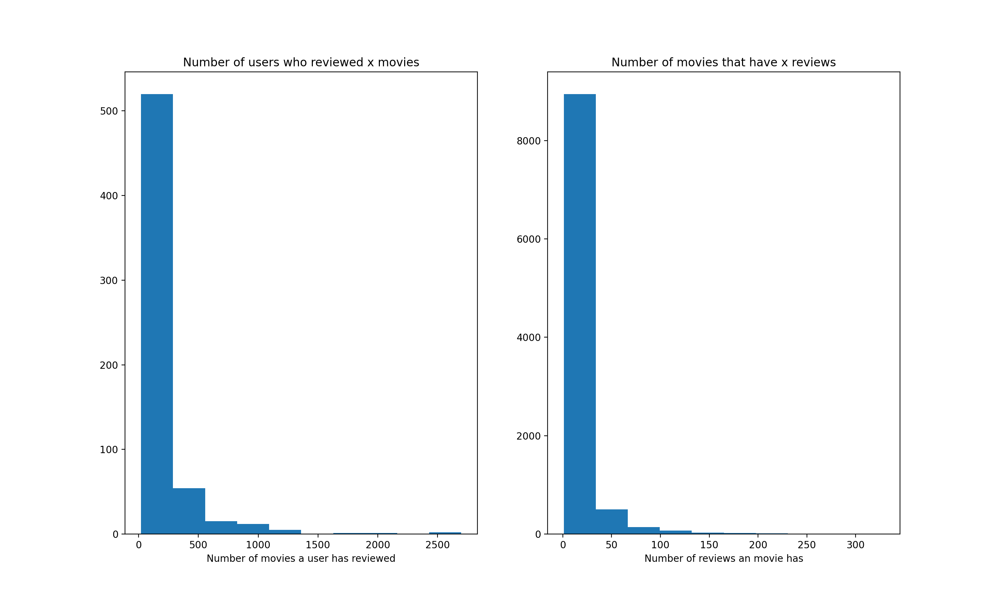

# movieRecModel

# Model
We are using Neural Colaberative Filtering in order to map user interactions with items
to ratings.

NCF is a generalization on Matrix Factorization. MF is used for reccomender systems but is not able to fully leverage large amounts of data as well as a neural net can.

Below is a diagram of the model:


On the left we embed users and items into an n dimentional latent vector space. We then take the dot product of the two vectors which encodes some information about the similarity of the user and item. After taking the dot product we concatenate the resulting vector with the output of the Multi Layered Perceptron on the right.

On the right we do a similar embedding into an m dimentional latent vector space. This time we concatenate the two vectors and pass them through an MLP.

Finally we concatenate the MF and the MLP outputs into an n + m dimentional vector and pass that through the final layer which maps from m + n -> 1. The final output is passed through a sigmoid function to bound it between 0 and 1.

# Data exploration



### Prerequisites
```
pip3 install requirements.txt
```

## Authors
Tristan Shah

## Credits
NVIDIA:

https://github.com/NVIDIA/DeepLearningExamples/tree/master/PyTorch/Recommendation/NCF

## License

This project is licensed under the MIT License - see the [LICENSE.md](LICENSE.md) file for details
